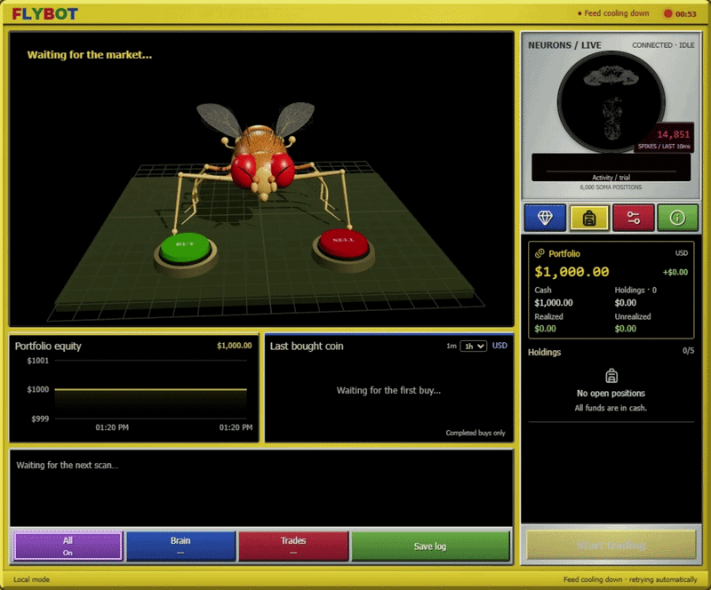
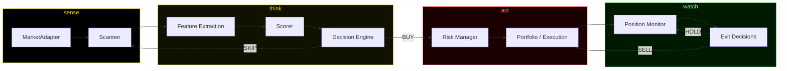

<div align="center">


# F L Y B O T

### an experimental autonomous trading organism, housed in a fly


<br/>

*newly hatched trading pairs. one fly. two buttons.*

<br/>



<sub>the actual console, doing the actual thing — scanning, waiting, deciding, in simulation mode</sub>

</div>

<br/>

> **LAB LOG — SPECIMEN 0x01**
> *Something has been running on a machine in the corner of the lab for a while now.*
> *It watches a feed of things that don't exist yet. When one appears, it looks at it.*
> *Sometimes it presses a button. Sometimes it doesn't. It does not explain itself*
> *unless you ask — but if you ask, it will tell you exactly why.*
> *This repository is what we found when we opened it up.*

<br/>

---

## Table of contents

- [What FLYBOT actually is](#what-flybot-actually-is)
- [The organism, in one loop](#the-organism-in-one-loop)
- [Live console walkthrough](#live-console-walkthrough)
- [Architecture](#architecture)
- [How a pair moves through the system](#how-a-pair-moves-through-the-system)
- [Decision logic in brief](#decision-logic-in-brief)
- [Risk containment](#risk-containment)
- [What's real vs. simulated](#whats-real-vs-simulated)
- [Quickstart](#quickstart)
- [Project structure](#project-structure)
- [Configuration](#configuration)
- [Tech stack](#tech-stack)
- [Tests](#tests)
- [Documentation index](#documentation-index)
- [Roadmap](#roadmap)
- [Contributing](#contributing)
- [License](#license)

<br/>

---

## What FLYBOT actually is

FLYBOT is a small autonomous agent that watches for **newly created
memecoin trading pairs**, evaluates each one against a scoring model the
moment it appears, and independently decides to **BUY** or **SKIP**. If it
buys, it keeps watching that position and decides for itself when to exit —
profit target, stop loss, trailing stop, time limit, or because the thesis
it bought on has quietly stopped being true.

The whole thing is presented as a fly, sitting in a retro trading-lab rig
with two big arcade buttons. That's not just a skin. The fly *is* the
agent: the compound eyes are the scanner, the legs are the position
monitor, the twitch before a decision is the scoring pass running, and
pressing **BUY** or **SELL** is genuinely the moment the trade executes.
When you watch it do nothing for a while and then suddenly move, that's
not decoration — that's the actual control flow in `flybot/execution/trader.py`.

Underneath the theater is a real, tested, swappable trading pipeline. Every
part of the visual metaphor maps to actual code, listed exactly in
[How a pair moves through the system](#how-a-pair-moves-through-the-system).

**Everything in this repository trades against a simulated market.** No
wallet, no private key, no live exchange connection, no real money, ever.
See [What's real vs. simulated](#whats-real-vs-simulated) for the precise
boundary, and [`docs/SIMULATION_VS_REAL.md`](docs/SIMULATION_VS_REAL.md)
for the full breakdown.

<br/>

## The organism, in one loop

```
                          ┌─────────────────────────────┐
                          │      NEW PAIR APPEARS        │
                          └───────────────┬─────────────┘
                                          │
                     compound eyes ▸ scanner.scan()
                                          │
                          ┌───────────────▼─────────────┐
                          │   pre-filter + de-duplicate  │
                          └───────────────┬─────────────┘
                                          │
                       antennae ▸ get_snapshot() + extract_features()
                                          │
                          ┌───────────────▼─────────────┐
                          │      brain ▸ score_pair()     │
                          │   confidence 0.00 — 1.00      │
                          └───────────────┬─────────────┘
                                          │
                        thorax twitch ▸ decide_entry()
                              ┌──────────┴──────────┐
                              ▼                     ▼
                          BUY 🟢                 SKIP ⚪
                              │
                   risk glands ▸ RiskManager veto + sizing
                              │
                       leg press ▸ execute_buy()
                              │
                          ┌───▼────────────────────────┐
                          │   POSITION UNDER WATCH      │
                          │   (peak tracking, decay      │
                          │    checks, live price)       │
                          └───┬────────────────────────┘
                              │
                      wing flutter ▸ decide_exit()
                    TP / SL / trail / time / decay
                              │
                       leg press ▸ execute_sell()
                              ▼
                          NEXT PAIR
```

FLYBOT never stops to think about a pair for long. New-pair edges are
short-lived by nature — the whole point of the design is a tight,
low-latency loop that can evaluate and act before the opportunity (or the
red flag) is gone.

<br/>

## Live console walkthrough

The panel in the GIF above is what's actually running underneath:

| On screen | What it really is |
|---|---|
| **Fly + BUY / SELL buttons** | The live `Action` the decision engine just returned, animated. The fly "waits" between ticks and reacts the instant a `Decision` fires. |
| **NEURONS / LIVE** activity readout | A stylized view of scoring activity — every feature computation and weight multiplication happening inside `evaluation/scorer.py`, represented as neural noise |
| **Portfolio · Cash · Holdings** | `Portfolio.summary()` in `flybot/execution/portfolio.py`, read directly |
| **Realized / Unrealized** | `Portfolio.realized_pnl_usd` and live mark-to-market from the current simulated price |
| **Last bought coin** | The most recent `Trade` with `side == "buy"` |
| **Portfolio equity graph** | Equity sampled over time — cash plus the mark-to-market value of every open position |
| **"Waiting for the next scan..."** | The literal state of the scanner between `poll_interval_ms` ticks |
| **All On / Brain / Trades / Save log** | Panel toggles for the console's logging views — Brain surfaces evaluation reasoning, Trades surfaces the fill log |
| **Feed cooling down · retrying automatically** | The scanner's dedupe/backoff window elapsing between pair discoveries |

None of this is a mockup layered over fake numbers. Run `scripts/run_demo.sh`
and watch the terminal output — it's the same state, just without the fly.

<br/>

## Architecture



Full diagram with every function call in [`docs/ARCHITECTURE.md`](docs/ARCHITECTURE.md).

Design principle: **every stage is swappable in isolation.** The scanner
doesn't know what a "good" pair is. The evaluator doesn't know how much
money is available. The risk manager doesn't know what a memecoin is. The
executor doesn't know why a trade was decided. This is what makes the
system testable (see [Tests](#tests)) and what makes
[going from simulation to a real adapter](docs/SIMULATION_VS_REAL.md) a
contained problem instead of a rewrite.

<br/>

## How a pair moves through the system

1. **Discovery** — `SimulatedAdapter.poll_new_pairs()` fabricates a new
   pair on a random schedule (`flybot/adapters/simulated.py`). A real
   adapter would subscribe to an on-chain feed or aggregator API here
   instead — nothing else in the pipeline would need to change.
2. **Scan & pre-filter** — `PairScanner.scan()` drops anything already
   seen, too young, too old, or on an unconfigured chain
   (`flybot/scanner/scanner.py`, [docs](docs/SCANNER.md)).
3. **Snapshot & features** — `get_snapshot()` returns raw market/on-chain
   data; `extract_features()` turns it into six normalized signals
   (`flybot/evaluation/features.py`, [docs](docs/EVALUATION.md)).
4. **Hard filters & scoring** — `score_pair()` disqualifies structurally
   unsafe pairs outright (honeypot, no LP lock, live mint authority, ...),
   then computes a weighted `confidence` for everything else
   (`flybot/evaluation/scorer.py`).
5. **Entry decision** — `decide_entry()` turns confidence into BUY or SKIP
   against `buy_confidence_threshold` (`flybot/decision/engine.py`,
   [docs](docs/DECISION.md)).
6. **Risk check & sizing** — `RiskManager.can_open_new_position()` can
   veto the BUY outright (position limits, circuit breaker, cooldown);
   if approved, `size_position()` computes how much to risk
   (`flybot/risk/manager.py`, [docs](docs/RISK.md)).
7. **Execution** — `Portfolio.open_position()` calls
   `adapter.execute_buy()` and books the fill (`flybot/execution/portfolio.py`).
8. **Monitoring** — every tick, `Trader._monitor_positions()` checks price;
   periodically it re-scores the pair entirely.
9. **Exit** — `decide_exit()` returns HOLD or SELL with a specific reason
   (take profit, stop loss, trailing stop, time stop, disqualification, or
   confidence decay); `Portfolio.close_position()` books the result and
   `RiskManager.record_trade_closed()` updates account state (streaks,
   circuit breaker, equity).
10. **Repeat**, for every pair, forever.

<br/>

## Decision logic in brief

```
BUY   if  NOT disqualified  AND  confidence ≥ buy_confidence_threshold
SKIP  otherwise

SELL  if  unrealized_pct ≥ take_profit_pct                    → take_profit
      or  unrealized_pct ≤ stop_loss_pct                      → stop_loss
      or  (armed AND drawdown_from_peak ≤ trailing_stop_pct)  → trailing_stop
      or  hold_time ≥ max_hold_seconds                        → time_stop
      or  rescan disqualifies the pair                        → liquidity_pulled
      or  rescored confidence < 50% of entry confidence       → confidence_decay
HOLD  otherwise
```

Full reasoning, worked examples, and the priority order these are checked
in: [`docs/DECISION.md`](docs/DECISION.md).

<br/>

## Risk containment

The decision engine decides what's *good*. The risk manager decides what's
*survivable*, and it has veto power over every BUY:

- position sizing = `min(absolute cap, % of equity, available cash)` — every time, all three
- hard cap on concurrent open positions
- **daily loss circuit breaker** — trips at `max_daily_loss_pct`, blocks all new entries for the rest of the day (does not self-reset intraday)
- **loss-streak cooldown** — N losses in a row stands the system down temporarily
- max trades per day, as a backstop against a misbehaving feed

Details and rationale: [`docs/RISK.md`](docs/RISK.md).

<br/>

## What's real vs. simulated

| | Status |
|---|---|
| New pair discovery | 🟡 **Simulated** — fabricated pairs, randomized archetypes |
| Prices | 🟡 **Simulated** — bounded random walk per pair |
| On-chain safety flags (LP lock, mint authority, honeypot, holder concentration) | 🟡 **Simulated** — randomly generated per archetype |
| Order fills | 🟡 **Simulated** — instant fill at current simulated price, no slippage modeling yet |
| Feature extraction & scoring | 🟢 **Real logic**, unit-tested, source-data-agnostic |
| Entry/exit decision rules | 🟢 **Real logic**, unit-tested |
| Risk management & circuit breakers | 🟢 **Real logic**, unit-tested |
| Portfolio accounting | 🟢 **Real logic** |
| Wallets, private keys, live trading | ⚫ **Not present anywhere in this repository** |

Full breakdown, and exactly what a real adapter would need to implement:
[`docs/SIMULATION_VS_REAL.md`](docs/SIMULATION_VS_REAL.md).

<br/>

## Quickstart

```bash
git clone https://github.com/your-org/flybot.git
cd flybot
python -m venv .venv && source .venv/bin/activate
pip install -r requirements.txt

# bounded, reproducible demo run (recommended first look)
python main.py --config config/config.example.yaml --ticks 150 --seed 7

# or let it run until you Ctrl+C
python main.py --config config/config.example.yaml
```

or just:

```bash
./scripts/run_demo.sh
```

Sample output:

```
   _____ _  __     ______  ____ _______
  |  ___| | \ \   / /  _ \/ __ \__   __|
  | |_  | |  \ \_/ /| |_) | |  | | | |
  |  _| | |   \   / |  _ <| |  | | | |
  | |   | |___| |  | |_) | |__| | | |
  |_|   |______|_|  |____/ \____/  |_|

        autonomous fly-brained trading experiment
        mode: SIMULATION -- no real funds, no real keys

[14:02:11] [SYS]    starting cash: $1,000.00 (simulation mode)
[14:02:12] [SCAN]   new pair DEGEN482/SOL on raydium-sim (age 6.1s)
[14:02:12] [EVAL]   DEGEN482 disqualified -- LP lock/burn below 60%
[14:02:14] [SCAN]   new pair MOG/SOL on meteora-sim (age 5.4s)
[14:02:14] [EVAL]   MOG confidence=0.74 liq=$41,203
[14:02:14] [DECIDE] MOG: BUY -- strong conviction (confidence 0.74); strongest signal: momentum_score
[14:02:14] [TRADE]  BOUGHT MOG @ $0.00780174 size=$120.00
   ...
[14:03:51] [TRADE]  SOLD MOG @ $0.01390210 pnl=$+93.87 (+78.2%) -- gave back 18% from peak (+92%) -- trailing stop
```

<br/>

## Project structure

```
flybot/
├── README.md
├── main.py                     # CLI entry point
├── requirements.txt
├── config/
│   └── config.example.yaml     # copy to config.yaml and adjust
├── flybot/
│   ├── core/
│   │   ├── models.py           # shared data types (Pair, Score, Decision, Position, ...)
│   │   ├── config.py           # typed config loader
│   │   └── logging_utils.py    # retro terminal logger
│   ├── adapters/
│   │   ├── base.py             # MarketAdapter interface
│   │   └── simulated.py        # the only shipped adapter — fabricated market
│   ├── scanner/
│   │   └── scanner.py          # new-pair discovery + pre-filtering
│   ├── evaluation/
│   │   ├── features.py         # raw snapshot -> normalized feature vector
│   │   └── scorer.py           # hard filters + weighted confidence score
│   ├── decision/
│   │   └── engine.py           # BUY/SKIP and HOLD/SELL logic
│   ├── risk/
│   │   └── manager.py          # sizing, exposure caps, circuit breaker
│   └── execution/
│       ├── portfolio.py        # cash/holdings/PnL bookkeeping
│       └── trader.py           # the main loop that ties it all together
├── tests/
│   ├── test_scoring.py
│   └── test_risk.py
├── docs/
│   ├── ARCHITECTURE.md
│   ├── SCANNER.md
│   ├── EVALUATION.md
│   ├── DECISION.md
│   ├── RISK.md
│   ├── CONFIGURATION.md
│   ├── SIMULATION_VS_REAL.md
│   └── LAB_NOTES.md
├── scripts/
│   └── run_demo.sh
└── assets/
    ├── flybot-logo.png
    ├── flybot-demo.gif
    └── flybot-demo.mp4
```

<br/>

## Configuration

Everything is one YAML file. No secrets, no keys — the shipped adapter
doesn't need any.

```yaml
decision:
  buy_confidence_threshold: 0.62
  take_profit_pct: 0.60
  stop_loss_pct: -0.22
  trailing_stop_pct: -0.18

risk:
  starting_cash_usd: 1000.0
  max_concurrent_positions: 5
  max_position_size_usd: 120.0
  max_daily_loss_pct: 0.20
```

Full reference for every key: [`docs/CONFIGURATION.md`](docs/CONFIGURATION.md).

<br/>

## Tech stack

| Layer | Choice | Why |
|---|---|---|
| Language | Python 3.10+ | Dataclasses + type hints give the pipeline typed boundaries without a heavy framework |
| Config | YAML → dataclasses | Human-editable, no code changes needed to retune thresholds |
| Market simulation | Pure Python, seedable RNG | Deterministic, reproducible demo runs with `--seed` |
| Testing | `pytest` | Evaluation and risk logic are pure functions/state machines — cheap to test exhaustively |
| Lint/CI | `ruff` + GitHub Actions | Keeps the small codebase small |
| Presentation | Retro ANSI terminal logger + this README | Because a trading experiment shaped like a fly deserves a console that looks like it |

No trading SDK, no exchange client library, no wallet library — because
this repository doesn't talk to a real exchange. That's the whole point.

<br/>

## Tests

```bash
pip install -r requirements-dev.txt
python -m pytest tests/ -q
```

```
tests/test_scoring.py ....                                              [ 40%]
tests/test_risk.py ......                                                [100%]

10 passed
```

Evaluation and risk management are pure logic with no I/O, so they're
covered directly: disqualification rules, score ordering (deep liquidity
should always outscore thin liquidity, all else equal), position sizing
under all three caps, the circuit breaker, and the loss-streak cooldown.

<br/>

## Documentation index

| Doc | Covers |
|---|---|
| [`docs/ARCHITECTURE.md`](docs/ARCHITECTURE.md) | Full pipeline diagram, module responsibilities, process boundaries |
| [`docs/SCANNER.md`](docs/SCANNER.md) | New-pair discovery and pre-filtering |
| [`docs/EVALUATION.md`](docs/EVALUATION.md) | Feature engineering and the scoring model |
| [`docs/DECISION.md`](docs/DECISION.md) | Entry/exit logic, priority order, worked example |
| [`docs/RISK.md`](docs/RISK.md) | Position sizing, circuit breaker, cooldowns, known limitations |
| [`docs/CONFIGURATION.md`](docs/CONFIGURATION.md) | Every config key, default, and meaning |
| [`docs/SIMULATION_VS_REAL.md`](docs/SIMULATION_VS_REAL.md) | Exact simulated/real boundary, what a real adapter would require |
| [`docs/LAB_NOTES.md`](docs/LAB_NOTES.md) | Dated design-decision notes and open problems |
| [`SECURITY.md`](SECURITY.md) | What this system does and doesn't touch, security posture for forks |

<br/>

## Roadmap

- [ ] Correlated-position risk (cap exposure to a cluster of related bets, not just position count)
- [ ] Slippage/partial-fill modeling in the simulated adapter
- [ ] Recorded-snapshot backtest replay mode, for reproducible strategy comparisons
- [ ] Multi-adapter fan-in (scan several sources/chains concurrently)

Details: [`docs/LAB_NOTES.md`](docs/LAB_NOTES.md#roadmap--open-problems)

<br/>

## Contributing

Small, typed, swappable modules; tests for anything with no I/O; no real
credentials, ever. Full guide: [`CONTRIBUTING.md`](CONTRIBUTING.md).

<br/>

## License

MIT — see [`LICENSE`](LICENSE). Experimental research/educational project;
not financial advice; simulated results are not indicative of real
trading performance.

<br/>

<div align="center">

<sub>

```
              _
   ,_        (o)>
   |\`--.__ /|
   ||    o   |
    \\  /\  //
     ||_||_||
```

**FLYBOT** · watching · waiting · deciding · trading · repeat

</sub>

</div>
