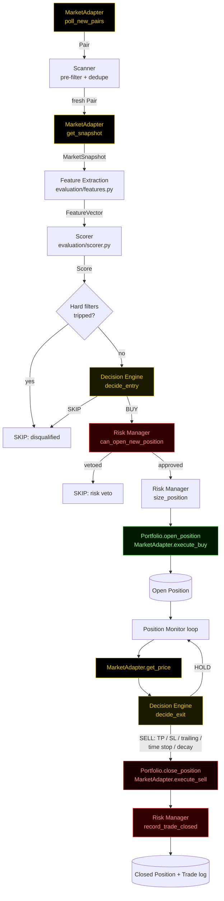

# FLYBOT Architecture

FLYBOT is a pipeline, not a monolith. Every stage is a small, independently
testable module that takes a typed input and produces a typed output (see
`flybot/core/models.py` for the shared vocabulary). Nothing downstream of
the adapter layer knows whether the market data behind it is simulated or
real -- that boundary is the whole point.

## The pipeline

## Modules and responsibilities

| Module | Responsibility | Does NOT do |
|---|---|---|
| `flybot/adapters/` | Talk to a market: discover pairs, read snapshots/prices, execute fills | Decide whether anything is worth trading |
| `flybot/scanner/` | De-duplicate and pre-filter the raw pair stream (age, chain, obvious junk) | Score or evaluate a pair's quality |
| `flybot/evaluation/` | Turn a snapshot into features, then a score, applying hard disqualifying filters | Decide BUY/SKIP outright |
| `flybot/decision/` | Turn a score into BUY/SKIP; turn a live position + price into HOLD/SELL | Size positions or enforce exposure limits |
| `flybot/risk/` | Position sizing, exposure caps, daily circuit breaker, loss-streak cooldown | Judge whether a pair is a *good* trade |
| `flybot/execution/` | Own portfolio state (cash, positions, PnL) and the top-level trading loop | Contain any trading logic itself |
| `flybot/core/` | Shared data models, config loading, retro terminal logging | -- |

This separation means, for example: you can rewrite the entire scoring
model without touching risk management, or drop in a stricter risk profile
without changing what the evaluator considers a "good" pair. Each stage's
job is described in more depth in its own doc:

- [`SCANNER.md`](SCANNER.md) -- how new pairs are discovered and pre-filtered
- [`EVALUATION.md`](EVALUATION.md) -- feature engineering and the scoring model
- [`DECISION.md`](DECISION.md) -- BUY/SKIP and exit logic in detail
- [`RISK.md`](RISK.md) -- position sizing and circuit breakers
- [`CONFIGURATION.md`](CONFIGURATION.md) -- full config reference
- [`SIMULATION_VS_REAL.md`](SIMULATION_VS_REAL.md) -- exactly what is fabricated vs. what is a real, reusable interface

## The trading loop

`flybot/execution/trader.py::Trader.tick()` is called on a fixed interval
(`scanner.poll_interval_ms`) and does two things every call, in order:

1. **`_scan_and_evaluate()`** -- pulls any newly discovered pairs from the
   scanner, and runs each one through evaluation -> decision -> risk ->
   execution.
2. **`_monitor_positions()`** -- for every currently open position, fetches
   the current price (cheap) and, on a slower cadence
   (`decision.confidence_decay_check_seconds`), a full re-scored snapshot
   (more expensive), then asks the decision engine whether to exit.

This two-speed design mirrors a real constraint: checking price is cheap
and should happen constantly; recomputing a full evaluation (which in a
real adapter might mean fresh RPC calls) is comparatively expensive and
only needs to happen often enough to catch a pair going bad, not on every
single tick.

## Process boundary

Everything above runs in a single process for the shipped simulation. The
module boundaries are drawn so that, if you wanted to split this into
services (a scanner service publishing to a queue, an evaluation worker
pool, an execution service with the only process allowed to hold key
material), the `flybot/core/models.py` types are already the message
schema you'd serialize across that boundary.
